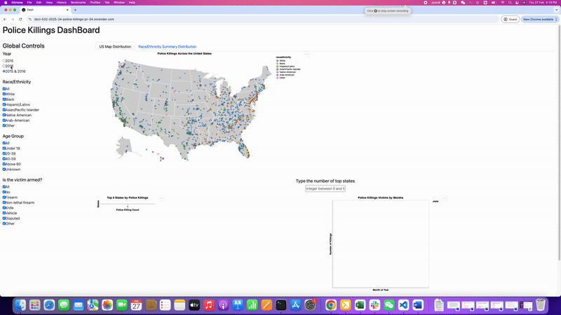

# Data-Driven Dashboard of Police Killings

## Summary

This project aims to develop an interactive data visualization dashboard that provides accessible, data-driven insights into police killings in the United States. By leveraging demographic, temporal, and geographic data, the dashboard will enable users to explore trends, identify high-risk areas, and analyze correlations between various factors and police use of force. By visualizing trends over time, identifying high-risk locations, and analyzing correlations between demographic characteristics and police use of force, the dashboard will serve as a valuable tool for government officials, policymakers, and the general public.

The ultimate goal is to foster a deeper understanding of the issue, inform policy changes, and support advocacy efforts for law enforcement accountability and reform.
This document serves as a hub to introduce the project, its purpose, and how you can get involved—whether as a user, contributor, or developer. Jump to one of the sections below and read on to learn more:

-   [What are we doing? (And why?)](#what-are-we-doing)
-   [Who are we?](#who-are-we)
-   [What do we need?](#what-do-we-need)
-   [How can you get involved?](#get-involved)
-   [Get in touch](#contact-us)
-   [Find out more](#find-out-more)

## What are we doing?

### The problem

Police use of excessive and lethal force is a critical and deeply entrenched societal issue, with far-reaching consequences for communities across the United States. This problem is particularly acute in underprivileged and marginalized communities, where systemic inequalities and racial biases often exacerbate the frequency and severity of police violence. Despite growing public awareness and advocacy efforts, the lack of accessible, data-driven insights remains a significant barrier to understanding the full scope of the issue and implementing effective solutions.


### The Solution

This project develops an **interactive data visualization dashboard** that provides accessible insights into police killings based on **demographic**, **geographic**, and **time-based factors**. With this tool, users can:

- **Explore police killings data over time**: Visualize trends and patterns to understand how incidents have evolved.
- **Identify high-risk locations**: Use heatmaps to pinpoint areas with higher concentrations of police killings.
- **Analyze trends across demographic groups**: Examine disparities based on race, age, gender, and armed status.
- **Support policy decisions**: Leverage real-time data visualization to inform evidence-based policy changes.

By providing a **structured, data-driven approach**, this platform empowers **policymakers**, **government officials**, and the **public** to better understand disparities in law enforcement practices and advocate for meaningful change.

## Who are we?

The Data-Driven Dashboard of Police Killings project is developed by a team of researchers and data scientists dedicated to using data for social justice. Contributors include Tingting Chen, Shawn Xiao Hu, Adrian Leung, and Rong Wan, as part of the UBC DSCI 532 project. 

## Collaboration and Support
This work is supported by advocates, policymakers, and data ethics researchers.This project is part of the **UBC DSCI 532** course, where we apply data science principles to real-world challenges. Our work is supported by:
- **Advocates**: Organizations and individuals working to promote police accountability and reform.
- **Policymakers**: Government officials and decision-makers seeking data-driven insights to inform policy changes.
- **Data Ethics Researchers**: Experts who guide us in ensuring ethical data collection, analysis, and visualization practices.
Together, we aim to create a platform that not only informs but also inspires action toward a more just and equitable society.

## What do we need?

We welcome contributions in various areas, including: 
-   Data Science & Engineering: Improving the quality of data aggregation and analysis. 
-   Web Development: Enhancing dashboard usability and scalability. 
-   Policy Research: Providing context for better interpretation of results. 
-   Community Outreach: Engaging with organizations and stakeholders.

If you have experience in any of these areas (or others we haven't considered yet!), we'd love your input!

## Get involved

### Live Dashboard:

<https://dsci-532-2025-24-police-killings.onrender.com/>

### Demo GIF

 Use this dashboard to explore police killings data, analyze trends, and support informed decision-making. For Developers & Contributors, read our [Contributing Guide](CONTRIBUTING.md) to get started!

### Instructions to Run and Contribute to App Locally
Step 1: Clone the repository

``` bash
git clone https://github.com/UBC-MDS/DSCI-532_2025_24_police_killings.git
cd DSCI-532_2025_24_police_killings
```

Step 2: Install dependencies and activate environment:

``` bash
conda env create -f environment.yaml
conda activate police_killings
```

Step 3: Run the app locally in the repository's root directory

``` bash
python src/app.py
```

Step 4: Open browser and navigate to `http://localhost:8050/` to view the dashboard.

Step 5: Start contributing!

-   Report issues or suggest enhancements in GitHub Issues: <https://github.com/UBC-MDS/DSCI-532_2025_24_police_killings/issues>
-   Share feedback on documentation and dataset usage: [Contributing](CONTRIBUTING.md).

## Find out more

Dataset Attribution: This project uses data from [Guardian's database on police killings from 2015-2016](http://www.theguardian.com/thecounted).

License: It is licensed under the terms of the [MIT license](LICENSE.md).

## Thank you

Thank you for your interest and support! Let's use data to drive meaningful changes.
