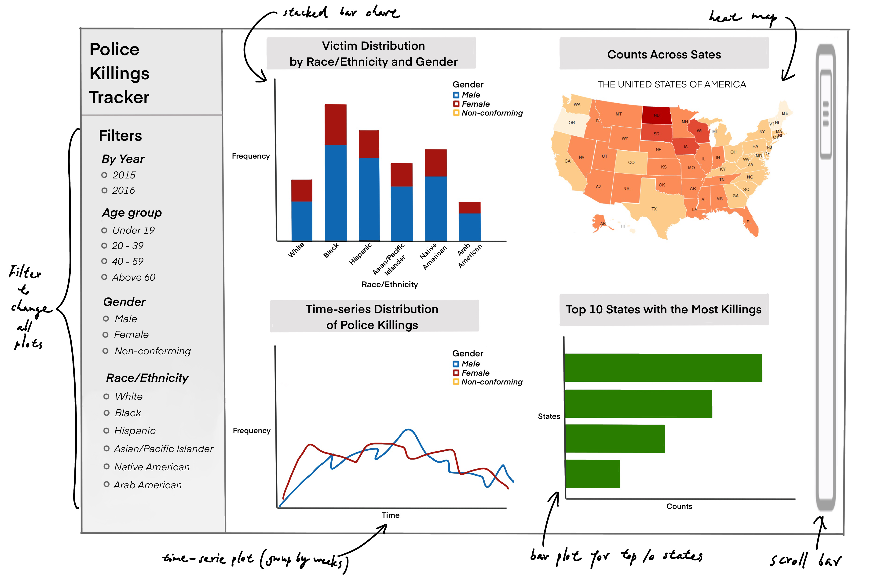

# Tentative - Dashboard proposal

## Motivation and Purpose

Our Role: Data Scientist Consultancy Firm Target Audience: Government
officials, policymakers, general public Police use of excessive (and
lethal) force is a significant societal issue, often disproportionately
affecting underprivileged communities. A major challenge is the lack of
accessible, data-driven insights that can help raise awareness and
inform policy changes to mitigate instances of police brutality.

To address this, we propose developing a data visualization dashboard
that enables users to explore police killing incidents based on
demographic, geographic, and socioeconomic factors. This dashboard will
provide interactive insights into trends over time, highlight high-risk
locations, and analyze the correlation between demographic factors and
police use of force.

Our tool will allow government officials and policymakers to identify
systemic issues, help the general public understand disparities in law
enforcement practices, and support social justice organizations in
advocating for better law enforcement training and accountability
measures.

## Description of the Data

## Research Questions

## App Sketch and Description

The app consists of 4 plots that show the relationship between different
variables and the counts of police killings. From the four plots, one
plot shows a heat map over the map of the United States to display the
severity of police killings across all states; one horizontal bar plot
that displays the top 10 states that have the most police killings; one
stacked bar plot that shows the distribution of victims over
race/ethnicity and gender; one density plot that shows the distributions
of victims over a changeable feature for each gender class. The
changeable feature can be selected by the user in the drop-down menu
next to the density plot, with options from the victim's level (i.e.
age) to the regional level (i.e. personal income, the ratio of house
income to county income, education level, and unemployment rate).

Aside from the drop-down menu for the density plot, the user can also
interact with all the plots by choosing multiple filters in time (on a
monthly basis), gender class (i.e. Male and Female), and race/ethnicity
(i.e. White, Black, and Hispanic). By toggling the filters, users can
visualize the distributions with certain conditions that are of
interest.
